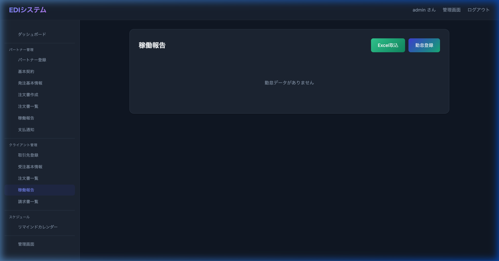
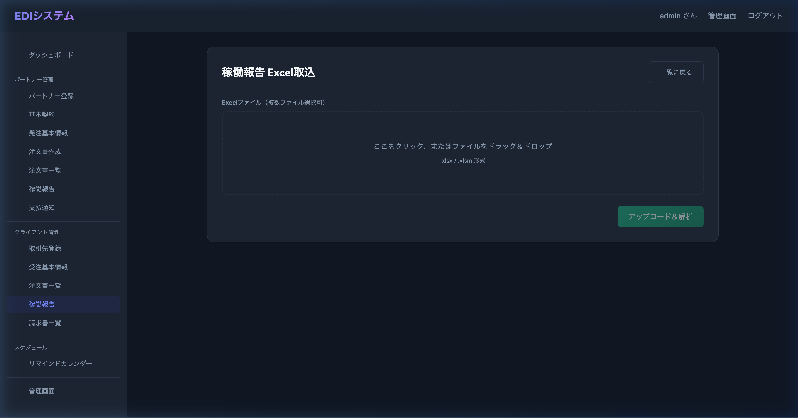

# EDI・注文管理システム ユーザーマニュアル

## 目次
1. [はじめに](#1-はじめに)
2. [推奨環境](#2-推奨環境)
3. [管理者向け機能 (自社担当者)](#3-管理者向け機能-自社担当者)
    - [3.1 ログイン](#31-ログイン)
    - [3.2 取引先・プロジェクト登録](#32-取引先プロジェクト登録)
    - [3.3 注文書の作成と発行](#33-注文書の作成と発行)
    - [3.4 請求書・支払通知書の作成](#34-請求書支払通知書の作成)
    - [3.5 承諾済み注文の確認](#35-承諾済み注文の確認)
4. [取引先向け機能 (パートナー)](#4-取引先向け機能-パートナー)
    - [4.1 初回ログインと企業情報登録](#41-初回ログインと企業情報登録)
    - [4.2 注文書の確認と承諾](#42-注文書の確認と承諾)
    - [4.3 請求書のダウンロード](#43-請求書のダウンロード)

---

## 1. はじめに
本システムは、注文書の発行・受領・承諾、および請求書・支払通知書の管理を一元的に行うEDIシステムです。
電子帳簿保存法およびインボイス制度に対応した帳票発行が可能です。

## 2. 推奨環境
- **ブラウザ**: Google Chrome (最新版), Microsoft Edge (最新版)
- **デバイス**: PC (Windows/Mac) 推奨

---

## 3. 管理者向け機能 (自社担当者)

### 3.1 ログイン
1. 管理者用ログインURLにアクセスします。
   - **ログインURL**: https://edi.macplanning.com/accounts/login/
   - **管理画面URL**: https://edi.macplanning.com/admin/
2. 管理者IDとパスワードを入力し、ログインしてください。
   - 管理者IDとパスワードはシステム管理者にお問い合わせください。

### 3.2 取引先・プロジェクト登録
注文書を作成する前に、マスタデータの登録が必要です。
1. **マスタ管理**メニューから「パートナー」または「プロジェクト」を選択します。
2. 「追加」ボタンを押し、必要な情報を入力して保存します。

### 3.3 注文書の作成と発行
**手順:**
1. ダッシュボードまたは「注文管理」メニューから「注文追加」を選択します。
2. 取引先、プロジェクト、期間、金額などの必須項目を入力し、「保存」します（ステータス：**下書き**）。
3. 作成した注文書の詳細画面を開き、内容を確認します。「注文書PDF」ボタンでプレビュー可能です。
4. 問題なければ「正式発行」ボタンを押します。
    - ステータスが「**未確認（発行済）**」となり、取引先に通知メールが送信されます。

### 3.4 請求書・支払通知書の作成
取引先からの請求書受領（または支払通知書発行）業務を行います。
**手順:**
1. 「注文管理」または「請求管理」メニューから、対象の注文（承諾済み）を選択します。
2. 「請求書作成」アクションを実行し、対象年月 (`target_month`) を指定します。
3. 自動計算された金額（稼働時間、超過・控除精算など）を確認し、保存します。
4. PDF出力:
    - **請求書PDF**: 11列レイアウト。自社控えや、自社発行の請求書として出力。
    - **支払通知書PDF**: 8列レイアウト。取引先へ送付する支払通知として出力。

### 3.5 承諾済み注文の確認
取引先が注文を承諾すると、ステータスが「**承諾済**」になります。
詳細画面から、取引先の署名（企業名）が入った「注文請書PDF」をダウンロードできます。

### 3.6 稼働報告（Excel取込）
Excelの稼働報告書から自動的に稼働報告データを取り込めます。

**手順:**
1. サイドバーの「**稼働報告**」メニューを選択します。
2. 「**Excel取込**」ボタン（緑色）をクリックします。

3. Excelファイル（`.xlsx` / `.xlsm`）をドラッグ＆ドロップ、またはクリックして選択します。複数ファイルの同時選択が可能です。

4. 「**アップロード＆解析**」ボタンを押します。
5. 解析結果の確認・編集画面が表示されます。
    - **受注**: 対象月と作業者名から自動的にマッチングされます。一致しない場合は手動で選択してください。
    - **作業者名、対象月、合計稼働時間、稼働日数**: 必要に応じて編集可能です。
    - **日別稼働データ**: アコーディオンで展開して確認できます。
    - 土日祝の稼働がある場合は⚠警告が表示されます。
6. 内容を確認し、「**登録**」ボタンを押すと稼働報告が一括登録されます。

### 3.7 取引先（クライアント）への稼働報告共有
アップロードされた稼働報告書を、取引先（クライアント）に共有し、Google Driveへの保存とメール通知を一括で行います。

**手順:**
1. サイドバーの「**稼働報告**」メニューから、対象の稼働報告データを開きます。
2. 画面下部の「**稼働報告メールプレビュー**」ボタンをクリックします。
3. 送信されるメールの件名、宛先、本文のプレビュー画面が表示されます。
4. 内容に問題がなければ、「**クライアントへ稼働報告を送付**」ボタンを押します。
   - これにより、稼働報告書（Excel）が所定のGoogle Driveへ自動アップロードされ、
   - 取引先に共有リンク付きの通知メールが自動送信されます。

---

## 4. 取引先向け機能 (パートナー)

### 4.1 初回ログインと企業情報登録
1. 招待メールに記載されたURL、ID、パスワードでログインします。
2. 初回ログイン時、またはダッシュボードの「会社情報を登録・更新する」ボタンから、以下の情報を登録してください。
    - 会社名、住所、電話番号
    - インボイス登録番号 (T番号)
    - 振込先口座情報

### 4.2 注文書の確認と承諾
**手順:**
1. ダッシュボードの「未承諾の注文」または通知から、新着の注文を選択します。
2. 注文詳細画面で内容を確認します。「注文書PDF」ボタンで書面をダウンロードできます。
3. 内容に同意する場合、「**承諾**」ボタンを押します。
    - これにより注文請書が自動生成され、契約締結となります。

### 4.3 請求書のダウンロード
**手順:**
1. 「請求書一覧」メニューを選択します。
2. 発行された請求書（支払通知書）が表示されます。
3. 「PDFダウンロード」ボタンから、自社保管用の請求書データを取得できます。

### 4.4 稼働報告書のアップロード
毎月の稼働報告書をExcelファイルでアップロードし、自社担当者に提出します。

**手順:**
1. サイドバーの「**稼働報告書**」メニューを選択します。
2. **対象注文**をドロップダウンから選択します。
3. Excelファイル（`.xlsx` / `.xlsm`）をドラッグ＆ドロップ、またはクリックして選択します。
    - 複数名分の報告書がある場合は、複数ファイルを同時に選択可能です。
4. 「**アップロード＆解析**」ボタンを押します。
5. チェック結果画面が表示されます。
    - **解析完了**: 正常にデータが読み取れた状態です。
    - **要確認**: 土日祝の稼働が検出された場合に表示されます。
    - **エラー**: ファイルの読み取りに失敗した場合に表示されます。
6. 各項目（作業者名、対象月、合計時間、稼働日数）は**直接編集**できます。
7. 日別稼働データは「日別稼働データを表示」をクリックして確認できます。
8. 内容を確認後：
    - 「**編集内容を保存**」→ 修正だけ保存し、後から確定可能
    - 「**稼働報告メールプレビュー**」→ 送信内容を確認して自社担当者に通知

