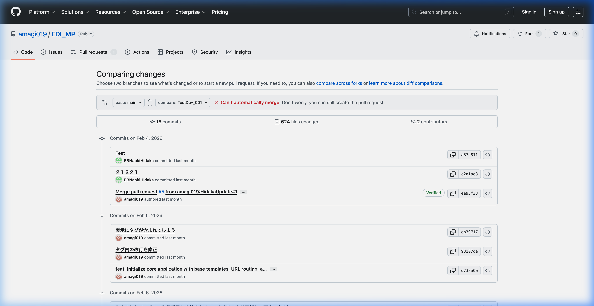
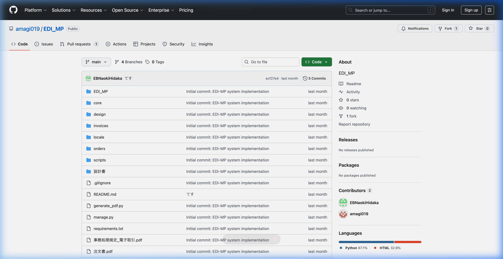

# Git 運用ガイド

## リポジトリ情報

- **URL**: https://github.com/amagi019/EDI_MP
- **メインブランチ**: `main`
- **開発ブランチ**: `TestDev_001`

---

## 開発ブランチから main へのマージ手順

### 1. ローカルの変更をpush

```bash
git add .
git commit -m "変更内容の説明"
git push origin TestDev_001
```

### 2. GitHubでPull Requestを作成

1. PR作成ページを開く:
   👉 https://github.com/amagi019/EDI_MP/compare/main...TestDev_001

2. ブランチを確認:
   - **base**: `main` ← マージ先
   - **compare**: `TestDev_001` ← マージ元

   

3. タイトルと説明を入力して **「Create pull request」** をクリック

4. 差分を確認後、**「Merge pull request」** → **「Confirm merge」** をクリック

5. （任意）マージ完了後 **「Delete branch」** でブランチ削除

---

## GitHubリポジトリ画面



---

## よく使うコマンド

```bash
# 状態確認
git status
git log --oneline -5

# ブランチ切替
git checkout main
git checkout TestDev_001

# リモートの最新を取得
git pull origin main

# ローカルでマージする場合
git checkout main
git merge TestDev_001
git push origin main
```
