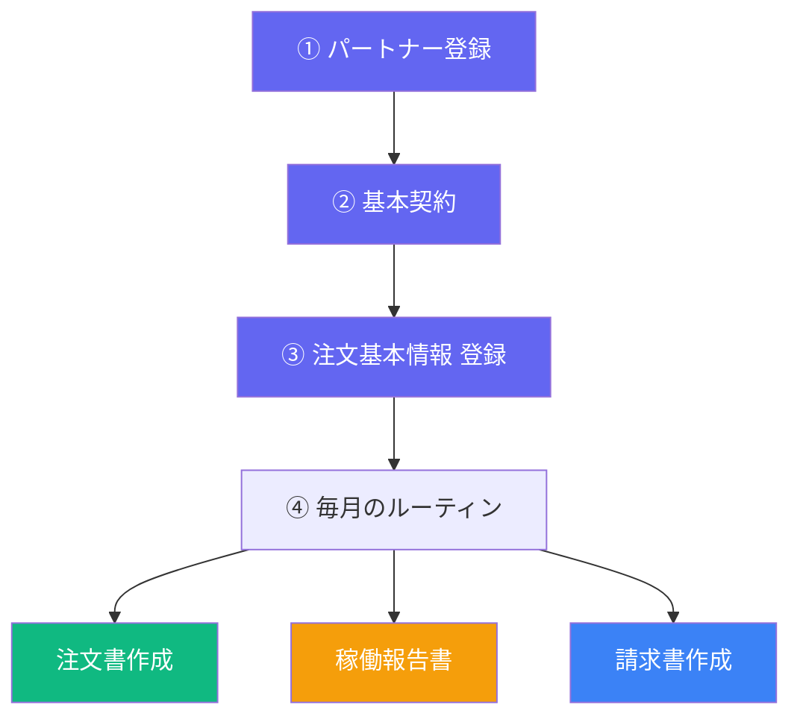

# EDI_MP 運用マニュアル

> 最終更新: 2026/3/18

---

## 全体フロー



---

## ④ 毎月のルーティン（詳細）

### 注文書の作成・発行


| ステップ | 操作 | 補足 |
|---------|------|------|
| **1. 作成** | 注文基本情報一覧 → 「注文書作成」 | 翌月分のドラフトが自動生成される |
| **2. 確認** | 編集画面で日付・担当者・明細を確認 | 必要に応じて修正 |
| **3. 発行** | 注文詳細 → 「正式発行」 | PDFが自動保存、パートナーにメール送信 |
| **4. 承諾** | パートナーが注文詳細画面で「承諾」をクリック | 注文請書が自動生成、月次タスクも「完了」に更新 |

---

### 稼働報告書の受領


| ステップ | 操作 | 補足 |
|---------|------|------|
| **1. アップロード** | パートナーがExcelをアップロード | 複数ファイル同時対応 |
| **2. 自動チェック** | 氏名・稼働時間・土日祝稼働を検出 | ⚠ 警告があれば要確認 |
| **3. 確定** | 内容確認後「稼働報告を確定」ボタン | 自社担当者にメール通知 |
| **4. 自動連携** | 確定されると請求書に稼働時間が自動セット | 請求書がなければ自動生成 |

---

### 請求書（支払通知書）の作成・発行


| ステップ | 操作 | 補足 |
|---------|------|------|
| **1. 作成** | 注文基本情報一覧 → 「請求書作成」 | 注文書が必要。なければ先に注文書作成 |
| **2. 編集** | 稼働時間を入力、金額は自動計算 | 報告書経由なら自動入力済み |
| **3. 確認依頼** | 「確認依頼」ボタン | DRAFT → 確認待ちに遷移 |
| **4. レビュー** | 自社担当者がPDF確認 → 承認 or 差戻し | 承認でパートナーにメール送信 |
| **5. パートナー承諾** | パートナーが承諾ボタン | 自社担当者にメール通知 |

> [!TIP]
> 稼働報告書が確定されると請求書は**自動生成**されます。手動作成は報告書なしで請求書を作りたい場合に使用してください。

---

## 画面一覧

| 画面 | URL | 用途 |
|------|-----|------|
| ダッシュボード | `/` | タスク一覧・超過警告 |
| 注文基本情報一覧 | 発注管理 → 注文基本情報 | 注文書/請求書のワンクリック作成 |
| 注文書一覧 | 発注管理 → 注文書一覧 | 全注文の状態確認・削除 |
| 注文書詳細 | 注文書一覧からタップ | PDF印刷・正式発行・編集・請求書作成 |
| 稼働報告書 | 稼働報告書 | アップロード・チェック・確定 |
| 請求書一覧 | 請求書一覧 | 全請求書の状態確認（DRAFTも表示） |
| 請求書編集 | 請求書作成後に自動遷移 | 稼働時間入力・確認依頼 |
| 請求書レビュー | 確認依頼後に自動遷移 | 承認・差戻し・PDF確認 |

---

## ステータスの流れ

### 注文書
```
下書き → 未確認（発行済）→ 承諾済
```

### 請求書
```
下書き → 確認待ち → 発行済 → パートナー承諾済 → 支払済
```
