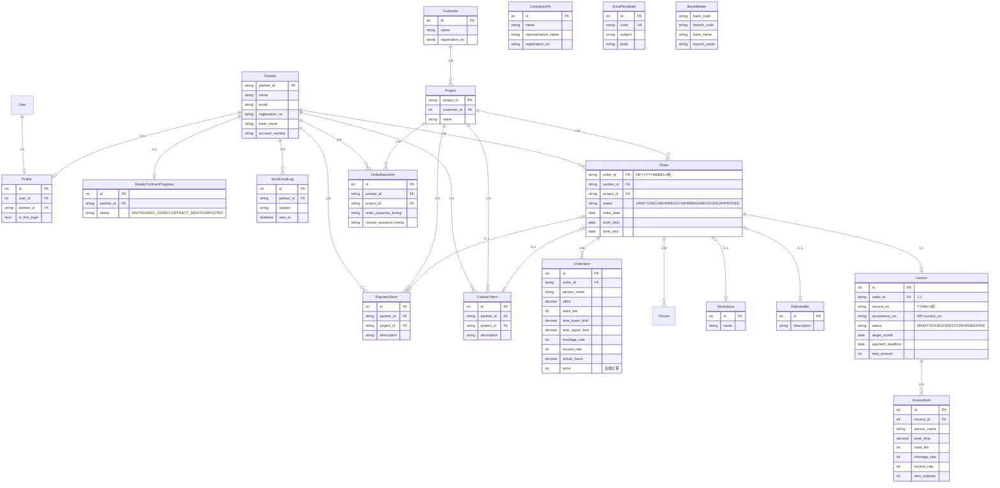

# ER図（エンティティ関連図）

## 概要

EDI-MPシステムの全テーブル構成。3アプリ・18テーブル。

## ER図

## テーブル一覧

| アプリ | テーブル | 説明 |
|--------|---------|------|
| core | Partner | パートナー（発注先） |
| core | Customer | 取引先（受注元） |
| core | Profile | ユーザープロフィール（User⇔Partner紐付け） |
| core | CompanyInfo | 自社情報 |
| core | MasterContractProgress | 基本契約進捗 |
| core | SentEmailLog | 送信メールログ |
| core | EmailTemplate | メールテンプレート |
| core | BankMaster | 銀行マスタ |
| orders | Project | プロジェクト |
| orders | Order | 注文（ヘッダー） |
| orders | OrderItem | 注文明細（作業者ごと） |
| orders | OrderBasicInfo | 発注基本情報（発行タイミング等） |
| orders | PaymentTerm | 支払条件マスタ |
| orders | ContractTerm | 契約条件マスタ |
| orders | Workplace | 勤務場所マスタ |
| orders | Deliverable | 成果物マスタ |
| orders | Person | 担当者 |
| invoices | Invoice | 請求・支払通知（ヘッダー） |
| invoices | InvoiceItem | 請求明細（作業者ごと精算） |

## フィールドの配置

> ✅ `base_fee`, `time_lower_limit`, `time_upper_limit`, `shortage_rate`, `excess_rate` は **OrderItem（明細）と InvoiceItem（請求明細）** に配置。Order（ヘッダー）からは削除済み。

| フィールド | OrderItem | InvoiceItem |
|-----------|-----------|-------------|
| base_fee | ✅ | ✅ |
| time_lower_limit | ✅ | ✅ |
| time_upper_limit | ✅ | ✅ |
| shortage_rate | ✅ | ✅ |
| excess_rate | ✅ | ✅ |
