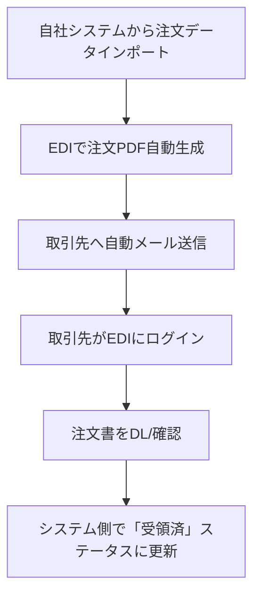
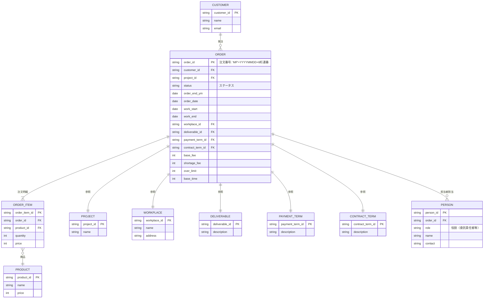

# 発注管理 業務フロー図（Mermaid記法）

```mermaid
flowchart TD
    A[自社システムから注文データインポート] --> B[EDIで注文PDF自動生成]
    B --> C[取引先へ自動メール送信]
    C --> D[取引先がEDIにログイン]
    D --> E[注文書をDL/確認]
    E --> F[システム側で「受領済」ステータスに更新]
```

# 発注管理 ER図（Mermaid記法）

```mermaid
erDiagram
    CUSTOMER ||--o{ ORDER : "発注"
    ORDER ||--|{ ORDER_ITEM : "注文明細"
    ORDER_ITEM }o--|| PRODUCT : "商品"
    ORDER ||--|| PROJECT : "参照"
    ORDER ||--|| WORKPLACE : "参照"
    ORDER ||--|| DELIVERABLE : "参照"
    ORDER ||--|| PAYMENT_TERM : "参照"
    ORDER ||--|| CONTRACT_TERM : "参照"
    ORDER ||--o{ PERSON : "担当者割当"

    CUSTOMER {
        string customer_id PK
        string name
        string email
    }
    ORDER {
        string order_id PK "注文番号: 'MP'+YYYYMMDD+6桁連番"
        string customer_id FK
        string project_id FK
        string status "ステータス"
        date   order_end_ym
        date   order_date
        date   work_start
        date   work_end
        string workplace_id FK
        string deliverable_id FK
        string payment_term_id FK
        string contract_term_id FK
        int    base_fee
        int    shortage_fee
        int    over_limit
        int    base_time
    }
    PERSON {
        string person_id PK
        string order_id FK
        string role "役割（委託責任者等）"
        string name
        string contact
    }
    PROJECT {
        string project_id PK
        string name
    }
    WORKPLACE {
        string workplace_id PK
        string name
        string address
    }
    DELIVERABLE {
        string deliverable_id PK
        string description
    }
    PAYMENT_TERM {
        string payment_term_id PK
        string description
    }
    CONTRACT_TERM {
        string contract_term_id PK
        string description
    }
    ORDER_ITEM {
        string order_item_id PK
        string order_id FK
        string product_id FK
        int quantity
        int price
    }
    PRODUCT {
        string product_id PK
        string name
        int price
    }
```
